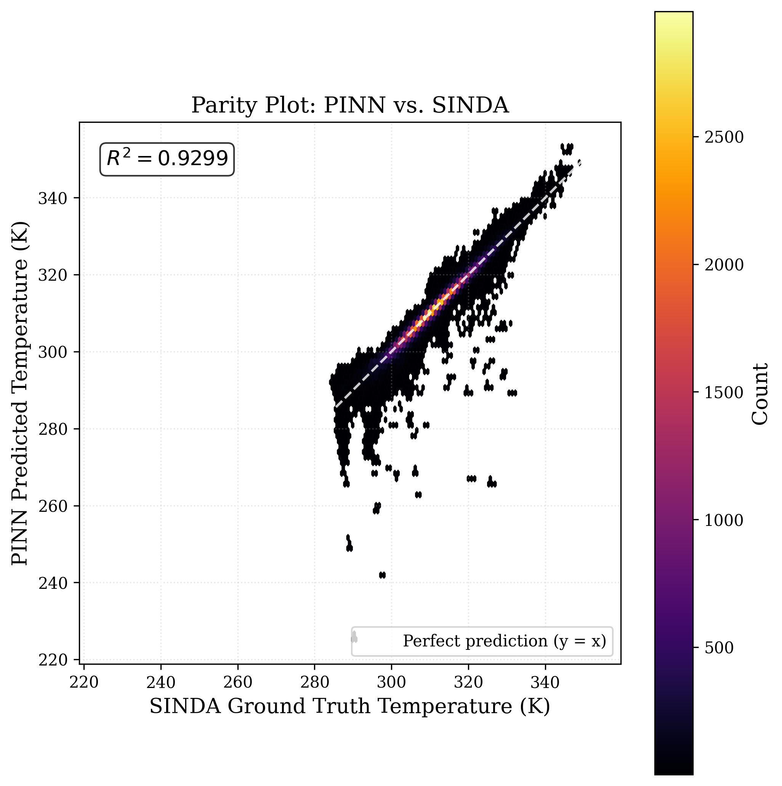

# Satellite Thermal Analysis with Physics-Informed Neural Networks

A PyTorch surrogate model that predicts steady-state spacecraft node temperatures **~<FILL IN: e.g. 500>× faster** than the underlying finite-difference thermal simulator, while respecting conservation of energy through a physics-informed loss.

> This public repo is a results showcase. The full codebase and raw data live in a private repo — available on request.

---

## TL;DR

| | |
|---|---|
| **Problem** | Each Thermal Desktop simulation takes minutes; design iteration needs thousands of runs. |
| **Approach** | Neural-network surrogate trained on a parameter sweep, with steady-state heat-balance enforced at training time. |
| **Key trick** | Predict 40 POD mode coefficients instead of 153 node temperatures — network stays small, physics plugs in cleanly. |
| **Result** | **MAE ≈ <FILL IN: X> K** on held-out test set, physically plausible fields, ~<FILL IN>× speedup vs. simulator. |

---

## Headline result

*Predicted vs. ground-truth node temperatures on the held-out test set. Diagonal = perfect prediction.*

---

## Repository map

- **[`methodology/`](methodology/)** — how the model works: governing physics, POD reduction, network architecture, loss formulation, training.
- **[`figures/`](figures/)** — full results gallery with captions, auto-updated from the private repo on every push to `main`.

---

## Method in 60 seconds

1. **Generate data.** A C# driver sweeps Thermal Desktop across spacecraft design parameters, producing ~<FILL IN: N> steady-state solutions.
2. **Compress.** SVD on the 153 × N training temperature matrix; keep the top 40 modes (>99% variance).
3. **Learn.** A small 3-layer MLP maps input heat loads to 40 POD coefficients; temperatures reconstructed as `T = U₄₀ · α`.
4. **Enforce physics.** Loss = data MSE + residual of `Q_in − Q_cond − Q_rad` + non-negativity penalty.
5. **Evaluate.** Held-out 15% test split; report parity, per-node error, physics residuals.

Full technical writeup: **[methodology/README.md](methodology/README.md)**.

---

## Tech stack

- **Simulation:** Thermal Desktop + SINDA, driven by a C# automation script
- **ML:** PyTorch, NumPy, SciPy
- **Data pipeline:** custom Python modules (QMAP parsing, conductance-matrix assembly, SVD)
- **Analysis:** Matplotlib, Pandas, Jupyter

---

## About

**Author:** Martin Nguyen — <FILL IN: role / school / year>
**Domain:** aerospace engineering × machine learning
**Contact:** <FILL IN: email / LinkedIn>

If you're a recruiter or collaborator interested in the full code, please reach out.
