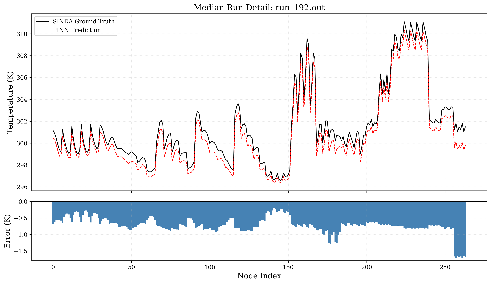

# Satellite Thermal Analysis with Physics-Informed Neural Networks

A PyTorch surrogate model that predicts the steady-state temperature of all **264 nodes** of a spacecraft thermal model from just **7 device power inputs** — trained on a blend of supervised SINDA simulation data and physics-informed heat-balance residuals, inspired by Tanaka & Nagai (2023).

**Martin Nguyen** — Aerospace Engineering, Physics minor — San José State University (Class of 2028)
[GitHub](https://github.com/martinng06/SatelliteML) · [LinkedIn](https://www.linkedin.com/in/martinnguyen0/) · marngu06@gmail.com


> Public-facing results showcase. The full codebase, raw simulation data, and C# Thermal Desktop automation layer live in a private repo — happy to walk through either on request.

---

## Headline result

<p align="center">
  
</p>

*A representative median-difficulty test case from the 500-run held-out set. Top: predicted (dashed) vs. SINDA ground truth (solid) for all 264 nodes. Bottom: per-node error, bounded within ±2 K for the majority of nodes.*

---

## What this project does

Spacecraft thermal analysis is slow. A single steady-state run in Thermal Desktop / SINDA takes minutes; robust design sweeps need hundreds or thousands of them, and the combinatorics of attitude × orbit × duty-cycle × device-power make the full design space effectively unreachable with the simulator alone.

This project builds a **Physics-Informed Neural Network (PINN) surrogate** that collapses that cost to milliseconds. The pipeline ingests 250 steady-state SINDA runs, compresses the 264-node temperature response into 40 POD (proper orthogonal decomposition) modes via SVD, and trains a small MLP to predict the POD coefficients from device-level power inputs. A physics loss — the residual of the steady-state heat-balance equation on the reconstructed temperature field — is blended with the supervised data loss so the network learns solutions that respect conduction and radiation, not just the training distribution.

The approach follows Tanaka & Nagai's POD-PIML methodology (*International Journal of Heat and Mass Transfer* 213, 2023), extended here with a **hybrid supervised + physics loss** and a **device-level input interface** that maps directly onto operational parameters engineers actually vary.

---

## Highlights

- **264-node thermal mesh → 40 POD modes** (6.6× compression; 99.9% variance captured by just 6 modes)
- **Hybrid loss** = MSE on POD coefficients (250 SINDA pairs) + steady-state heat-balance residual on 3 200 synthetic device-power samples per epoch
- **7-device input interface** (computer, powerboard, avionics, battery, GNC, payload, radio) — no per-node heat-load engineering required at inference time
- **Physics consistency verified**: PINN mean |residual| (0.20 W) matches SINDA itself (0.20 W) on the test set
- **Zero non-physical predictions**: 0 / 132 000 predicted temperatures below 0 K
- **End-to-end pipeline**: C# Thermal Desktop driver → Python data extraction → SVD → PyTorch training → CSV prediction export
- **9 publication-quality evaluation figures** covering parity, per-node / per-run error, physics residuals, POD spectrum, and non-negativity

---

## Results snapshot

Held-out test set: **500 steady-state runs × 264 nodes = 132 000 predictions**.

| Metric | Value |
|---|---|
| Mean Absolute Error | **1.11 K** |
| Median Absolute Error | 0.67 K |
| RMSE | 2.24 K |
| Max Absolute Error | 65.19 K |
| Mean Bias | −0.17 K |
| R² | 0.9299 |
| MAPE | 0.36% |

Per-run accuracy (mean absolute error aggregated over all 264 nodes):

| Run class | MAE |
|---|---|
| Best test run (`run_224`) | 0.05 K |
| Median test run (`run_192`) | 0.72 K |
| Worst test run (`run_91`) | 13.35 K |

Physics consistency on the test set:

| | Mean \|residual\| | Max \|residual\| |
|---|---|---|
| SINDA ground truth | 0.199 W | 33.58 W |
| **PINN prediction** | **0.200 W** | **32.86 W** |

Non-negativity: **0 / 132 000** predictions below 0 K (min predicted T = 225 K).

Full figure gallery and discussion: **[figures/](figures/)**.

---

## Repository map

```
satellite-thermal-ml/
├── methodology/          Technical deep-dive: physics, POD, network, loss, training
├── figures/              Evaluation figures (auto-synced from private repo)
└── README.md             You are here
```

The private repo's internal layout:

```
├── pipeline/             01_process_data → 02_train_model → 03_evaluate_model
├── src/
│   ├── config.py         Node / device constants, mapping matrices
│   ├── data/             QMAP parsing, C/R conductance matrices, Q/T matrix builders
│   ├── models/           SpacecraftThermNet + physics_loss
│   └── visualization/    Plotting utilities
├── notebooks/            01_Data_Exploration, 02_PINN_Prototyping, 03_Model_Evaluation
├── models/               Saved weights + SVD tensors (U_40, S_40, T_mean, normalization)
├── reports/figures/      Publication figures
└── simulation_models/    Thermal Desktop / SINDA inputs (immutable)
```

---

## Method in 60 seconds

1. **Generate data.** A C# driver sweeps Thermal Desktop across spacecraft operating points, producing 250 steady-state SINDA solutions for the "prior" dataset and 500 independent runs for the held-out test set.
2. **Compress.** SVD on the 264 × 250 training temperature matrix; keep the top 40 modes (>99.9% variance).
3. **Learn.** A 3-layer MLP (7 → 150 → 150 → 40, SiLU activations) maps standardized device powers to POD coefficients α. Temperatures reconstructed as `T = α · U₄₀ᵀ + T_mean`.
4. **Enforce physics.** Total loss `L = L_data + 0.1 · L_phys` where `L_phys` penalizes the residual of `Q_in − C·T − σ·R·T⁴` with a deep-space boundary correction at 3 K, plus a hinge penalty for any predicted T < 0 K.
5. **Evaluate.** 500-run held-out test set. Parity, per-node MAE, per-run MAE, physics residuals, POD spectrum, non-negativity.

Full technical writeup: **[methodology/README.md](methodology/README.md)**.

---

## Tech stack

- **Simulation:** Thermal Desktop + SINDA, driven by a C# Visual Studio automation project
- **ML:** PyTorch, NumPy, SciPy
- **Data pipeline:** custom Python modules for QMAP parsing, conductance-matrix assembly (C, R ∈ ℝ²⁶⁴ˣ²⁶⁴), and SVD
- **Analysis:** Matplotlib, Seaborn, Pandas, Jupyter
- **Training:** Adam optimizer, lr 1e-4, 30 000 epochs, GPU-aware

---

## Inspiration

> Tanaka, H. & Nagai, H. (2023). *Thermal surrogate model for spacecraft systems using physics-informed machine learning with POD data reduction.* **International Journal of Heat and Mass Transfer**, 213, 124336. [DOI: 10.1016/j.ijheatmasstransfer.2023.124336](https://doi.org/10.1016/j.ijheatmasstransfer.2023.124336)

Their POD-PIML formulation — predicting POD mode coefficients with a physics-informed loss — is the methodological foundation. This project extends it with (i) a blended supervised + physics loss and (ii) a device-level input interface designed for real operational use. See the [methodology README](methodology/README.md) for a side-by-side comparison.

---

## Contact

**Martin Nguyen**
Aerospace Engineering · Physics minor · San José State University · Class of 2028
[github.com/martinng06/SatelliteML](https://github.com/martinng06/SatelliteML) · [linkedin.com/in/martinnguyen0](https://www.linkedin.com/in/martinnguyen0/) · marngu06@gmail.com

Open to internships and research opportunities in aerospace thermal analysis, spacecraft systems engineering, and applied ML.
