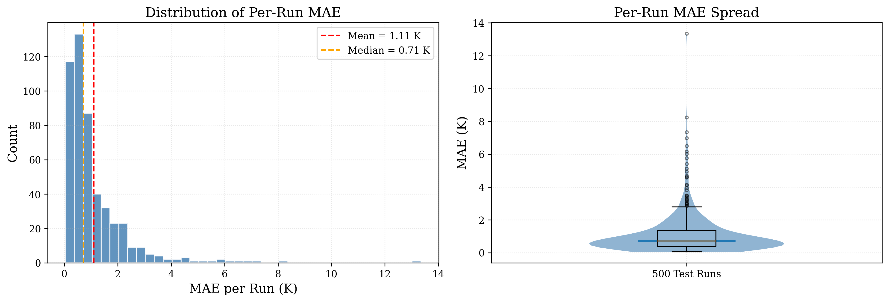
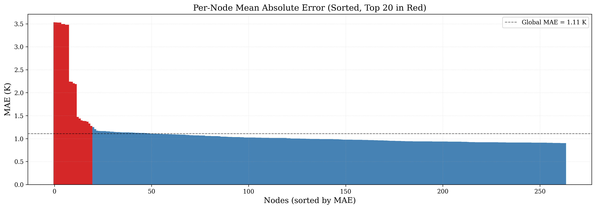
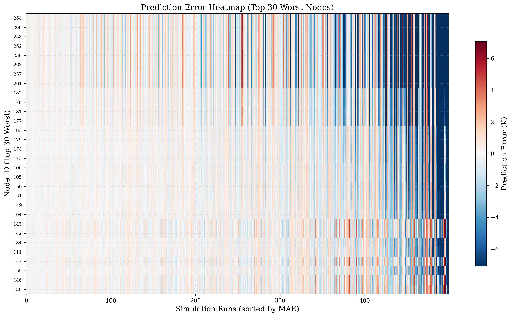
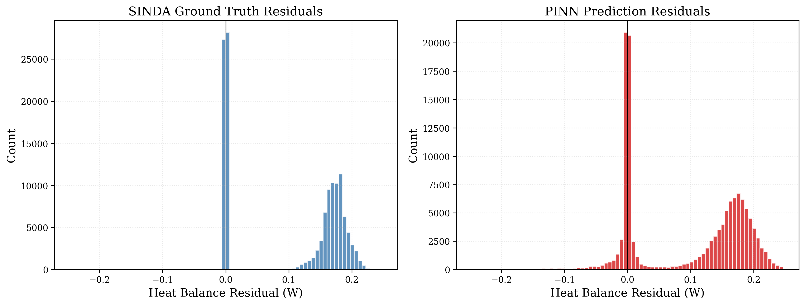
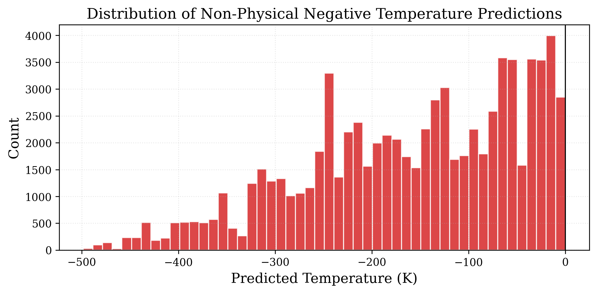
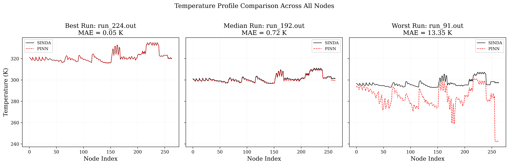
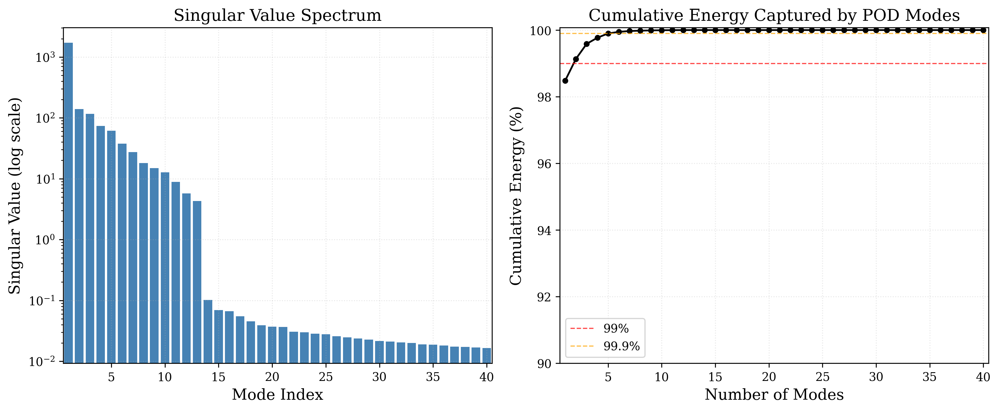

# Figures

All figures in this folder are **auto-generated** by evaluation scripts in the private repo and **auto-synced** here on every push to `main`. Do not edit the PNGs directly — edits will be overwritten on the next sync.

Last regeneration date is implicit in the commit timestamp of each file.

---

## Prediction accuracy

### Parity plot

Predicted vs. ground-truth node temperature on the held-out test set. Tight clustering along the diagonal indicates low bias across the temperature range.

### Per-run error distribution

Distribution of mean absolute error across test runs — shows whether errors are concentrated in a few difficult runs or spread evenly.

---

## Where errors concentrate

### Per-node MAE, sorted

Nodes ranked by mean absolute error. The tail identifies hot-spot nodes where the surrogate is weakest — typically high-gradient regions near heat-dissipating components.

### Error heatmap

Absolute error for every (node, run) pair. Vertical bands = hard runs; horizontal bands = hard nodes.

---

## Physics consistency

### Physics residuals

Distribution of the steady-state heat-balance residual `Q_in − Q_cond − Q_rad` across predictions. The physics loss drives this toward zero.

### Negative-temperature distribution

How often (and by how much) raw network outputs dip below 0 K. The non-negativity penalty drives this rare and small.

---

## Representative predictions

### Temperature profile comparison

Predicted vs. ground-truth temperature profile for a representative test run.

### Median-run detail

Zoomed detail of a median-difficulty test run — useful for qualitative sanity check of the prediction shape.

---

## POD analysis

### Mode energy spectrum

Singular-value spectrum and cumulative variance captured. 40 modes capture >99% — this is what allows the network to stay small.
